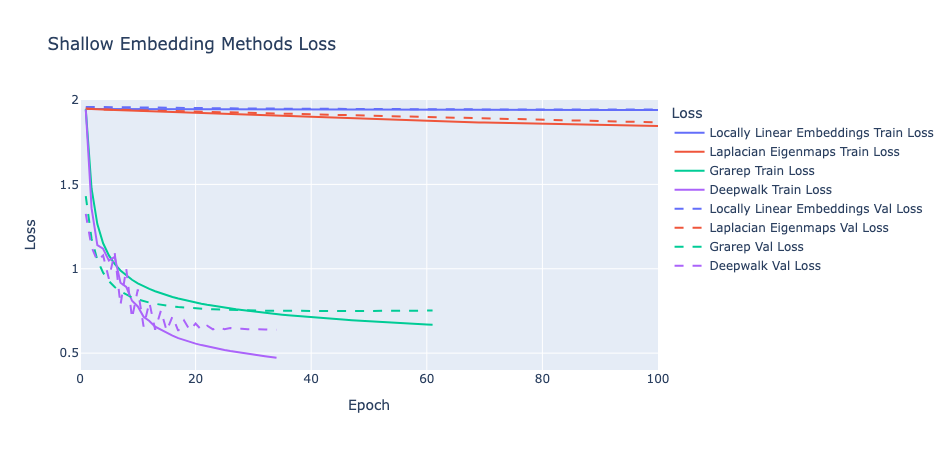

# Implementation of Shallow Graph Embedding Methods on the Cora Dataset

## Overview

This repository contains an implementation of shallow graph embedding methods for the Cora dataset using PyTorch. The Cora dataset consists of a citation network where nodes represent documents, and edges represent citation relationships between them. The goal of this implementation is to apply shallow graph embedding techniques to learn low-dimensional representations of nodes in the graph, which can then be used for downstream tasks such as node classification.

Table of Contents

	1.	Installation
	2.	Dataset
	3.	Shallow Graph Embedding Methods
	4.	Training Procedure
	5.	Results


### Installation

Prerequisites

To install the necessary dependencies, you can use the following command:
```
pip install -r requirements.txt
```

### Dataset

The Cora dataset consists of 2708 scientific publications classified into one of seven classes. The citation network has 5429 edges. The dataset comes with a 1433-dimensional sparse bag-of-words feature vector for each publication. The task is to classify each document into one of the predefined classes.

### Shallow Graph Embedding Methods

This implementation supports the following shallow graph embedding methods:

	1.	Locally Linear Embedding (LLE): A manifold learning technique that preserves local relationships by reconstructing each point as a linear combination of its neighbors. In the graph context, it aims to find embeddings that respect the local structure of the graph.
	2.	Laplacian Eigenmaps: A spectral embedding method that uses the graph Laplacian to compute low-dimensional representations. It seeks to preserve the proximity between neighboring nodes in the graph, making it ideal for capturing local structure.
	3.	GraRep: A matrix factorization-based method that captures higher-order proximities by factorizing the k-step transition probability matrix of the graph. It is designed to learn global structural representations.
        4.	DeepWalk: A random walk-based embedding method that learns node representations by treating truncated random walks as sentences and applying the Skip-Gram model. DeepWalk captures both local and global structure by leveraging random walks to explore different regions of the graph.

Each method generates low-dimensional embeddings were used for node classification tasks.

To find out more about these methods, please visit my website: https://www.mathstoml.com.

### Training Procedure

For training, 25% of the dataset was used as the training dataset, 25% for the validation dataset, and 50% for the test dataset. The only preprocessing applied was during the embedding processes.

A logistic regression model was trained on the training embeddings using the steepest descent method with a learning rate determined by estimating the Lipschitz constant, ensuring linear convergence. The best performing weights were saved and replaced only when a set of weights with better validation loss was found. Each model was trained until there was no further improvement in validation loss within a specified number of epochs.

Model performance was evaluated using two key metrics: loss and accuracy. Loss was computed using negative log-likliehood.

From the plots, locally linear embeddings and Laplacian eigenmaps exhibited linear convergence. Interestingly, the other two methods demonstrated a faster convergence rate and converged within 100 epochs, which was unexpected given that the step size was designed to ensure linear convergence.

For reproducibility, seed 42 was set in the torch training script. For other packages, the defeault training seeds were used.


### Results

The evaluation metrics include test loss, test classification accuracy, and the test f1 score. 

The best test results from the Cora dataset were:

	•	LLE: Loss = 1.193, Accuracy = 60.6%, F1= 62.1%
	•	Laplacian Eigenmaps: Loss = 0.818, Accuracy = 75.0%, F1 = 73.8%
	•	GraRep: Loss = 1.030, Accuracy = 65.5%, F1 = 67.1%
	•   DeepWalk: Loss= 0.846, Accuracy = 72.1%, F1= 72.1%

I've also attached a photo of the training loss below.


### Next Steps
* Investigate why the two last methods exhibited super-linear convergence (or better convergence).
